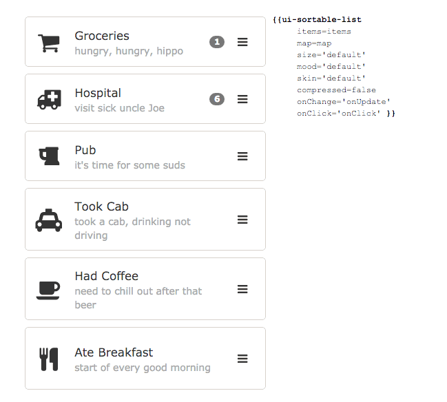

# ui-list  [](http://badge.fury.io/js/ui-list) [](https://codeclimate.com/github/lifegadget/ui-list)
> List controls for ambitious Ember applications.

## Overview ##



Lists are everywhere and now you've got a companion for your lists. Whether you want sort them, take action on them,
or just have a smart way of displaying them.

[](https://vimeo.com/141975827)

## Install ##

- Ember-CLI versions 0.2.3+
    ````bash
    ember install ui-list
    ````

- Earlier CLI versions
    ````bash
    npm install ui-list --save-dev
    ember g ui-list
    ````

## Usage ##
For more details on the syntax, documentation, and general goodness check out the interactive demo:

> [ui-list demo](https://ui-list.firebaseapp.com/)


## Version Compatibility

This may very well work with older version of Ember and Ember-CLI but it was intended for:

- Ember 1.11.0+
- Ember-CLI 0.2.3+

## Repo Contribution

We're open to your creative suggestions but please move past the "idea" stage
and send us a PR so we can incorporate your ideas without killing ourselves. :)

## Licensing

This component is free to use under the MIT license:

Copyright (c) 2015 LifeGadget Ltd

Permission is hereby granted, free of charge, to any person obtaining a copy of
this software and associated documentation files (the "Software"), to deal in
the Software without restriction, including without limitation the rights to
use, copy, modify, merge, publish, distribute, sublicense, and/or sell copies
of the Software, and to permit persons to whom the Software is furnished to do
so, subject to the following conditions:

The above copyright notice and this permission notice shall be included in all
copies or substantial portions of the Software.

THE SOFTWARE IS PROVIDED "AS IS", WITHOUT WARRANTY OF ANY KIND, EXPRESS OR
IMPLIED, INCLUDING BUT NOT LIMITED TO THE WARRANTIES OF MERCHANTABILITY,
FITNESS FOR A PARTICULAR PURPOSE AND NONINFRINGEMENT. IN NO EVENT SHALL THE
AUTHORS OR COPYRIGHT HOLDERS BE LIABLE FOR ANY CLAIM, DAMAGES OR OTHER
LIABILITY, WHETHER IN AN ACTION OF CONTRACT, TORT OR OTHERWISE, ARISING FROM,
OUT OF OR IN CONNECTION WITH THE SOFTWARE OR THE USE OR OTHER DEALINGS IN THE
SOFTWARE.
